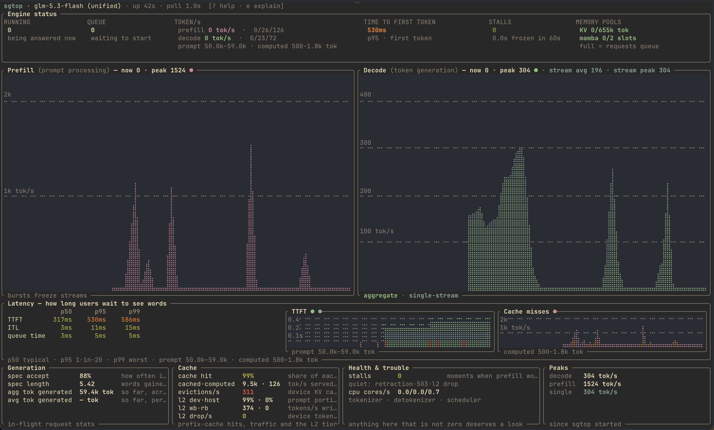
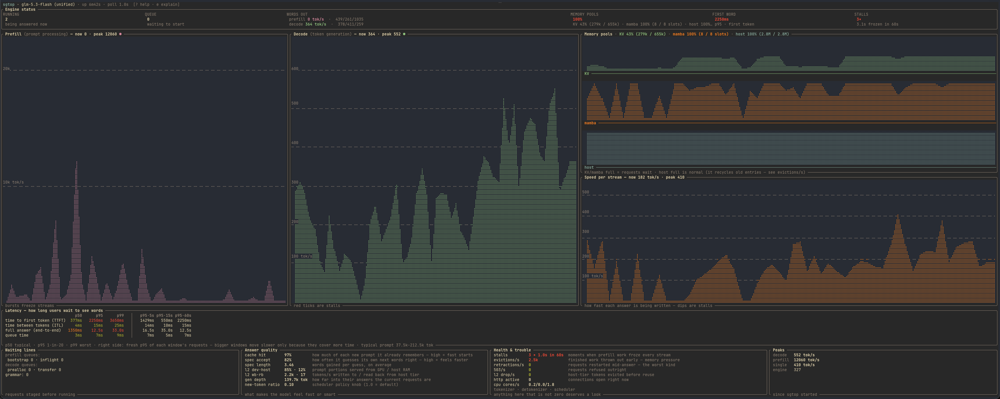
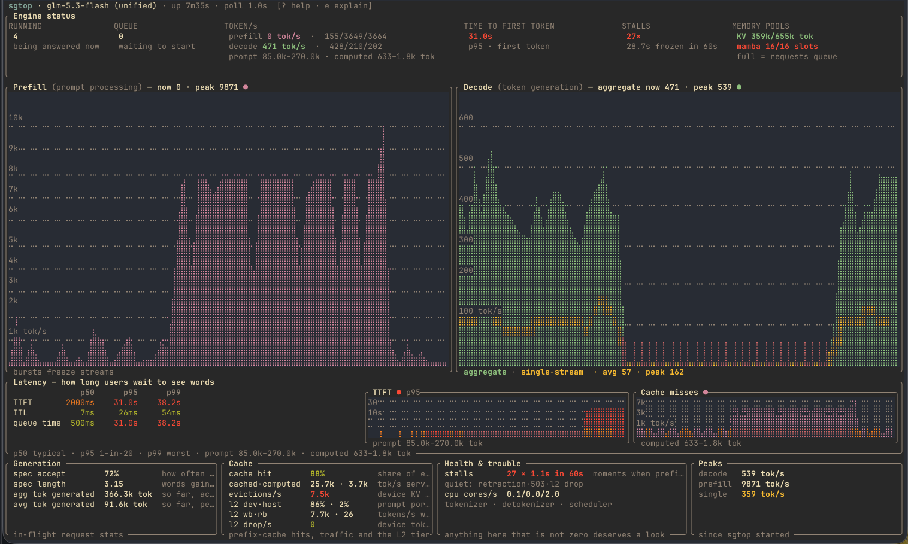

# sgtop

Live terminal dashboard for a sglang inference server: prefill/decode
histograms, TTFT and cache-miss plots, latency percentiles. Portable
binary, no storage, no daemon.

<p align="center">
  
</p>

<p align="center">
  
</p>

<p align="center">
  
</p>

## Features

- **Rate histograms.** Prefill and decode tok/s share the full terminal
  width on a fixed 60s wall-clock
  axis, newest sample pinned to the right edge. Dashed gridlines at every
  10/100/1k… multiple through the observed peak, anchored to the session
  peak (re-anchors on engine restart).
- **Stall detection.** Decode-rate collapse below 25% of the running median
  while prefill is active and requests are in flight; red ticks mark the
  intervals on the decode and latency plots, orange ticks mark intervals
  where the eviction counter advanced. The seesaw — a prefill spike riding
  a decode dip — is the long-prompt-freezes-everyone signature.
- **Memory pools.** KV, mamba, SWA and host (L2) tiers as absolute counts
  (`KV 0/655k tok · mamba 0/4 slots`) in the status strip and `--once`
  output — no percentages, which had no readable denominator and no
  action attached. Counts are aggregated across TP ranks per metric type
  without double-counting the logical KV capacity (`max_total_num_tokens`
  is exported per rank but is one logical pool). The MEMORY POOLS cell
  colors those readings by the worst non-host fullness: the
  requests-will-wait warning. KV/mamba full = requests wait; host full is
  normal (an LRU prefix cache that recycles its own old entries;
  `evictions/s` tracks the device KV cache, not the host tier).
- **Latency plots.** TTFT (first-token wait, p95 shaded with p50 as
  the line over it) plotted per interval over the 60s window, next to the
  cache-miss plot: computed prompt tokens/s from the exporter's
  `prefill_effective_tokens_total` counter (the prefix-cache misses the GPU
  actually computed), both with red stall ticks and orange eviction ticks
  on the axis. The table beside the plots shows TTFT, ITL and queue time
  as p50/p95/p99 of the focused window — a fresh quantile computed from
  histogram bucket deltas, no smoothing across windows; the cumulative
  snapshot is only a labeled fallback when a window is sparse. The e2e
  row is left out (workload-dependent); once-mode output still prints it.
- **Health counters.** Evictions/s, retractions/s, 503/s, retracted
  requests, l2 drop/s (device KV tokens destroyed without a host backup),
  tokenizer/detokenizer/scheduler CPU cores.
- **Two phase vocabularies.** Graph titles gloss prefill as *prompt
  processing* and decode as *token generation* (llama.cpp terms); `e` opens
  a full glossary/explain screen.

## Quick start

Install from prebuilt binaries (Linux x86_64/arm64, Windows x86_64/arm64,
macOS universal):

```
curl -LO https://github.com/mratsim/sgtop/releases/latest/download/sgtop-0.1.0-linux-x86_64.tar.gz
# or: go to https://github.com/mratsim/sgtop/releases/latest
tar -xzf sgtop-0.1.0-linux-x86_64.tar.gz
sudo mv sgtop-0.1.0-linux-x86_64/sgtop /usr/local/bin/
```

or build from source:

```
cargo install --path .      # installs `sgtop`
```

then:

```
sgtop                       # watches sglang's default port (30000)
sgtop --url http://localhost:30000 --interval 1.0
sgtop --url https://gpu-box.home.example.org --insecure   # self-signed proxy
sgtop --api-key sk-...                                    # if server uses --api-key
sgtop --once                # one text snapshot, for scripts/cron
```

`--insecure` accepts any server certificate: the bearer token and the metrics
transit without TLS verification. While it is active, a `⚠ insecure TLS`
marker appears in the header and in `--once` output.

## Keys

| Key | Action |
|---|---|
| `q` / `Esc` | quit |
| `space` | pause scraping |
| `c` | toggle compact / full layout |
| `g` | toggle graphs |
| `1` `2` `3` | focus the 5s / 15s / 60s window (graphs stay 60s) |
| `t` | cycle theme (gruvbox, catppuccin, tokyonight) |
| `e` | explain screen |
| `?` | keymap |
| `+` / `-` | poll interval (clamped 0.5–10s) |
| `↑` `↓` | scroll the explain screen |

Layout auto-fits: full at ≥26 rows × ≥90 cols, compact below (subtitles
collapse first, then graphs). Fits half or quarter of a 1920×1080 screen.
